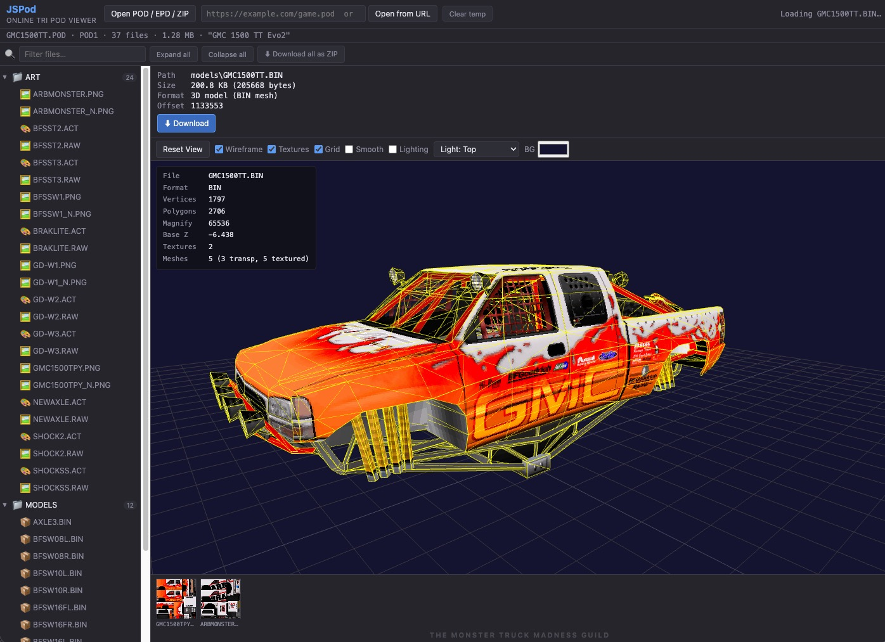

# JSPod

[](https://developer.mozilla.org/docs/Web/JavaScript)
[](https://threejs.org/)
[](https://developer.mozilla.org/docs/Web)
[](https://juanputrerasm.github.io/JSPod/)
[](LICENSE)

**A browser-based archive explorer and asset viewer for Terminal Reality POD files.**

JSPod opens POD, EPD, and ZIP archives without uploading their contents to a server. It presents the archive as a searchable file tree, previews common game assets, and can extract one file or repack the complete archive as ZIP.

**Live application:** [Open JSPod on GitHub Pages](https://juanputrerasm.github.io/JSPod/)



---

## Features

- **Local or remote archives** — open files from disk, a URL, or an autoload query parameter.
- **Private client-side processing** — indexing, decoding, and preview generation happen in the browser.
- **Archive navigation** — search and browse a collapsible directory tree with entry metadata.
- **Asset previews** — inspect textures, palettes, 3D models, text, audio, and common web images.
- **Modern MTM2 (Community Patch 3) support** — read extended POD1 directories, long BIN texture names, material records, PNG/TGA textures, and tangent-space normal maps.
- **Extraction** — download a selected entry or export the archive contents as a ZIP.

## Supported archive formats

| Format | Description | Support |
|---|---|---|
| POD1 | Original Terminal Reality POD layout | Read |
| POD1-64 (Extended POD1) | POD1-compatible layout with 64-byte entry names | Read |
| POD2 | POD2 archive layout | Read |
| EPD | Enhanced POD layout | Read |
| ZIP | Loads the first POD contained in the ZIP | Read |

“POD1-64” is not an official new POD version. The archive remains POD1-compatible and widens each directory name field from 32 to 64 bytes.

## Preview support

| File types | Preview |
|---|---|
| `.BIN`, `.LWO` | Interactive Three.js model viewer with orbit controls. An animated BIN opens on frame 1 with a bar naming every frame and where it resolves from; **Play** or the **A** key steps through them |
| `.RAW` | Paletted or grayscale texture with automatic dimension detection and ACT palette selection |
| `.ACT` | 256-color palette grid |
| `.PNG`, `.TGA`, `.BMP`, `.JPG`, `.JPEG`, `.GIF`, `.WEBP` | Image preview |
| `.TXT`, `.INI`, `.TRK`, `.SIT`, `.SI2`, `.SIX`, `.SIY`, `.TRX`, `.TXV`, `.LVL`, `.DEF`, and other text formats | Text preview |
| `.WAV` | Audio player |

CommPatch tracks and the disabled forms of tracks and trucks are described and
previewed alongside the originals: `.SI2` is a track only newer engines see, `.TXV`
is the plain-text record asserting what the pod around it contains, and `.SIX`,
`.SIY` and `.TRX` are `.SIT`, `.SI2` and `.TRK` renamed to something the game passes
over. Art files name the map they are: a `_N`, `_AO`, `_DTL` or `_MASK` suffix on a
`.RAW`, `.PNG` or `.TGA` stem is reported as a normal map, ambient occlusion,
terrain detail normal or terrain detail mask.

The BIN viewer understands classic and modern MTM2 records, including long texture names, material assignments, reflection and color blocks, and material parameters. For diffuse textures it resolves `.PNG`, then `.TGA`, then `.RAW`; `_N` normal maps use DirectX/green-down tangent space. Their RGB channels are decoded as X/Y/Z, alpha is ignored, and the engine has no roughness texture channel.

For early POD1 archives, JSPod also reads the hidden `.ACT` palette name stored after a `.RAW` path in the fixed-width directory field.

Palettes are ranked the same way in the RAW preview and the BIN texture fallback: the entry's own same-name `.ACT` and the name recorded in the directory field first, then the archive's own `METALCR2.ACT`, then its `VGA.ACT`, then the bundled palettes, greyscale, and every differently-named `.ACT` last. The archive's own METALCR2 outranks the bundled copy because METALCR2 is not one palette - CPR ships a different one from MTM1 and MTM2 - and a `VGA.ACT` in the pod means a flight game whose exact title cannot be told apart from here, so the pod's copy is the only safe pick. A differently-named `.ACT` is offered but never chosen automatically. The BIN selector supplies the fallback for textures that have no same-name `.ACT`, so same-name palettes belonging to other textures are listed there but never lead.

In the interactive BIN preview, use the Left and Right Arrow keys to strafe the camera.

## Requirements

- A modern browser with JavaScript modules, Web Workers, WebGL, and Origin Private File System support
- An HTTP or HTTPS origin; browsers do not provide the required features when opened through `file://`
- Network access to the Three.js and fflate CDN modules

## Getting started

### Use the hosted application

1. Open [JSPod on GitHub Pages](https://juanputrerasm.github.io/JSPod/).
2. Choose **Open POD / EPD / ZIP**, or paste an archive URL and choose **Open from URL**.
3. Select an entry in the file tree to preview or download it.

> [!NOTE]
> Remote archives must be served over HTTP or HTTPS. Cross-origin servers must also allow the browser request through CORS.

### Run locally

Clone the repository and serve its root directory with any static HTTP server:

```bash
git clone https://github.com/juanputrerasm/JSPod.git
cd JSPod
python3 -m http.server 8080
```

Then open <http://localhost:8080/>. There is no build step and no package installation.

## URL integration

JSPod can automatically load an archive supplied through either `url` or `file`:

```text
https://juanputrerasm.github.io/JSPod/?url=https%3A%2F%2Fexample.com%2Fgame.pod
https://juanputrerasm.github.io/JSPod/?file=%2Fdownloads%2Fgame.zip
```

Relative archive paths are resolved against the viewer page. When both parameters are present, `url` takes precedence.

## Architecture

| Component | Role |
|---|---|
| ES modules | Application, preview, and user-interface code |
| Module Web Worker | POD indexing, entry reads, and asset decoding off the main thread |
| OPFS | Temporary per-session archive storage |
| Three.js r169 | BIN/LWO rendering and camera controls |
| fflate 0.8.2 | ZIP import and export |

```text
src/
├── pod-app.js              Application controller
├── preview/                File-type preview modules
├── shared/                 Shared OPFS helpers
├── ui/                     File tree and dialog components
├── worker/                 Archive, BIN, texture, and image decoders
├── file-type-info.js       Extension metadata and preview routing
└── zip-utils.js            ZIP archive handling
```

## Known limitations

- JSPod is an archive viewer and extractor; it does not edit or rebuild POD files.
- ZIP input opens the first POD member rather than merging multiple archives.
- Browser image decoding availability depends on the browser's worker APIs.
- Rendering approximates the updated MTM2 material behavior in Three.js; it is not an exact copy of the game renderer.

## Related projects

- [JSTruckViewer](https://github.com/juanputrerasm/JSTruckViewer) — assembles and displays complete MTM2 trucks from TRK and POD data.
- [KPodman](https://github.com/juanputrerasm/KPodman) — desktop POD archive manager.

## Format documentation

- [POD1-64 / Extended POD1](docs/POD1_64_FORMAT.md)
- [BIN HD / Extended BIN](docs/BIN_HD_FORMAT.md)

## Credits and license

Developed by **Juan Pablo Utreras** for the Monster Truck Madness Guild.

Released under the [Apache License 2.0](LICENSE).

Monster Truck Madness and Terminal Reality are trademarks of their respective owners. This project is an independent community tool and is not affiliated with or endorsed by them.
